# CH 4 클라우드_아키텍쳐 설계 & 배포

## LV 0 - 요금 폭탄 방지 AWS Budget 설정
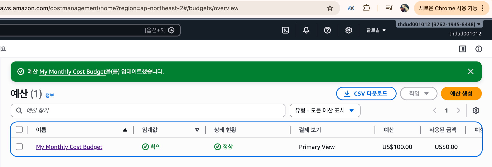
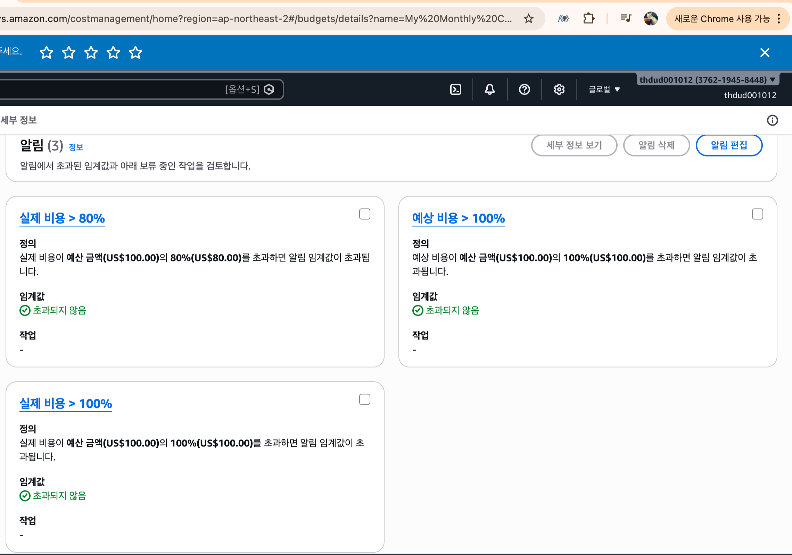

## Lv 1 - 네트워크 구축 및 핵심 기능 배포
EC2 Public IP : 43.202.50.2
### 실행 사진
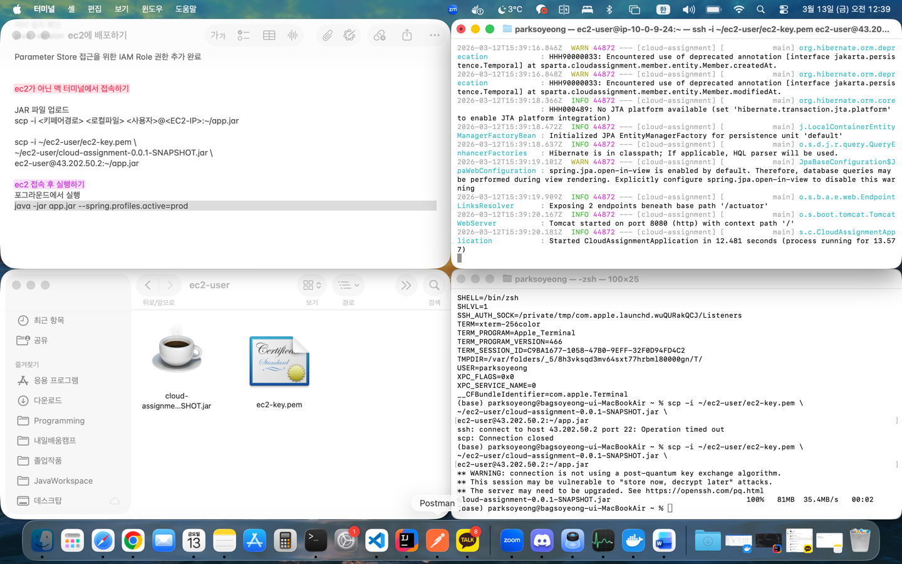

```GET http://43.202.50.2:8080/actuator/health```
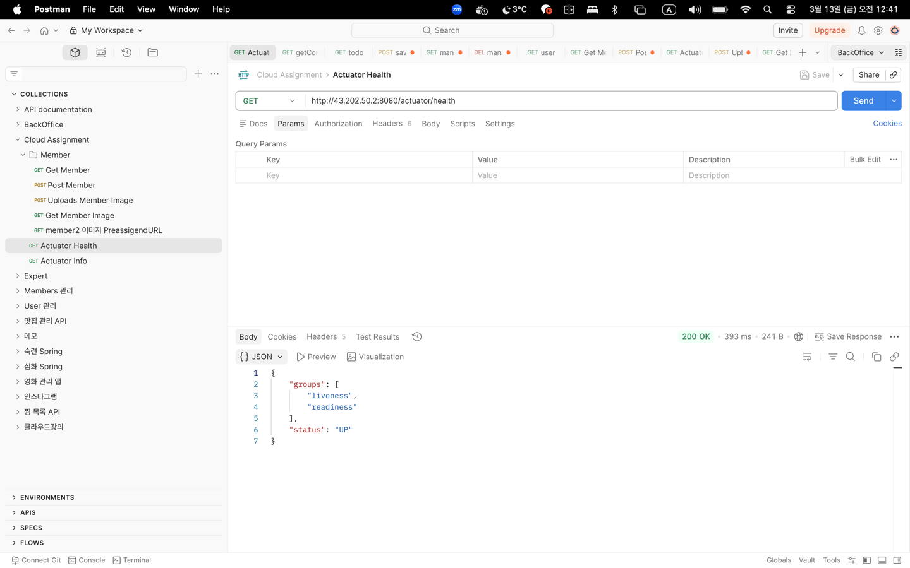

## Lv 2 - DB 분리 및 보안 연결하기

### RDS 구축 및 보안 그룹 체이닝
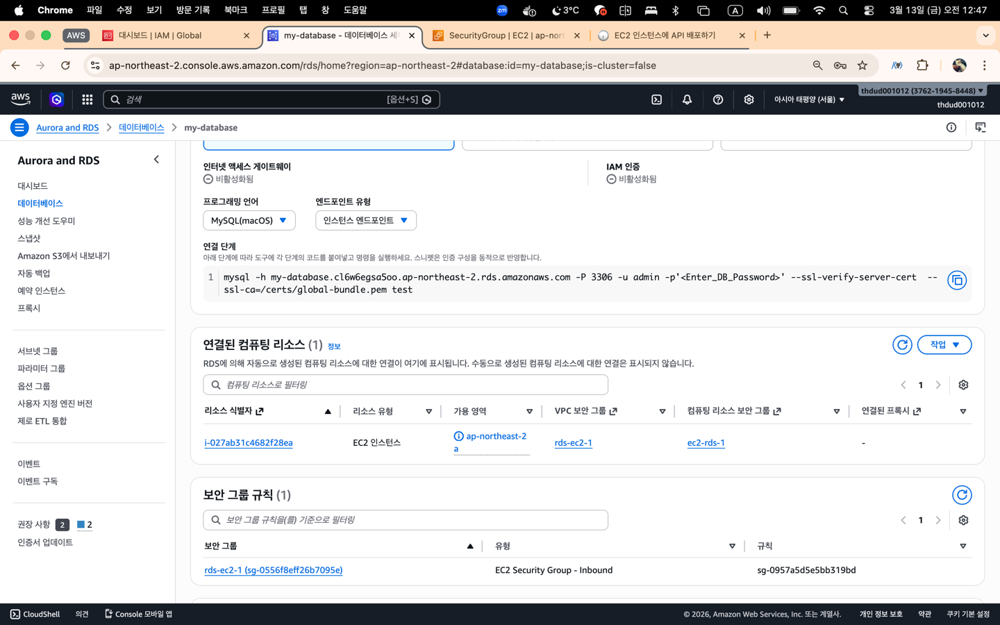

### EC2 보안 그룹
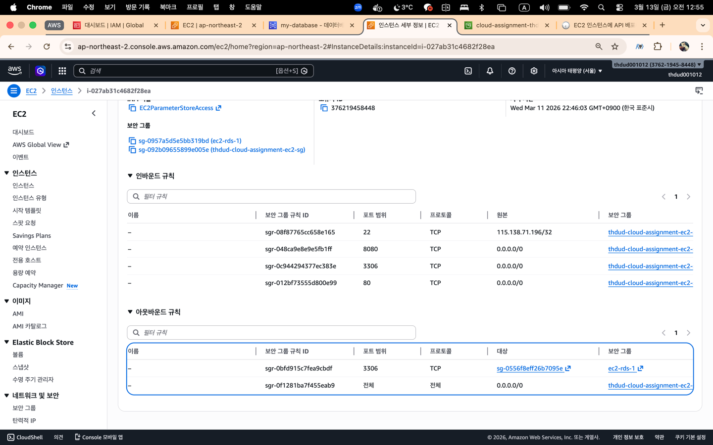

### 파라미터 스토어 설정
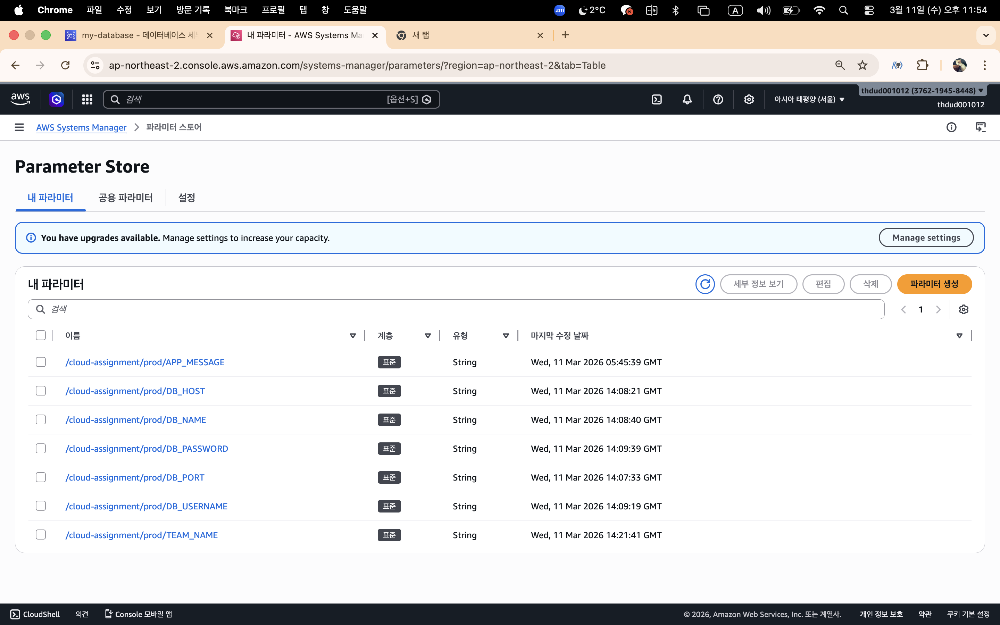

### Actuator Info 확장
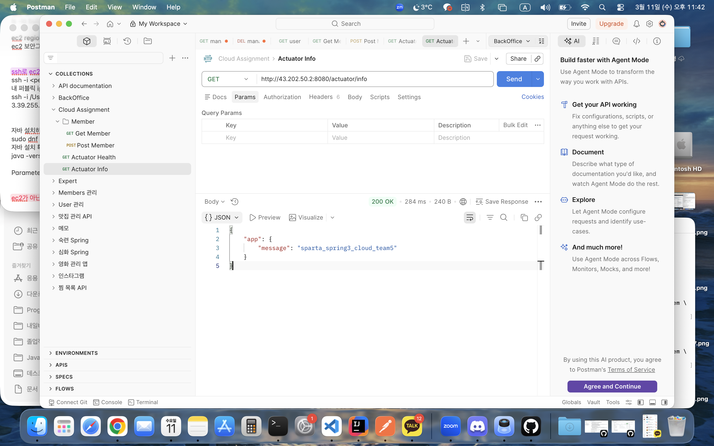

URL : http://43.202.50.2:8080/actuator/info

## Lv 3 - 프로필 사진 기능 추가와 권한 관리
### s3 접근 권한을 가진 IAM Role
IAM ROLE : EC2ParameterStoreAccess
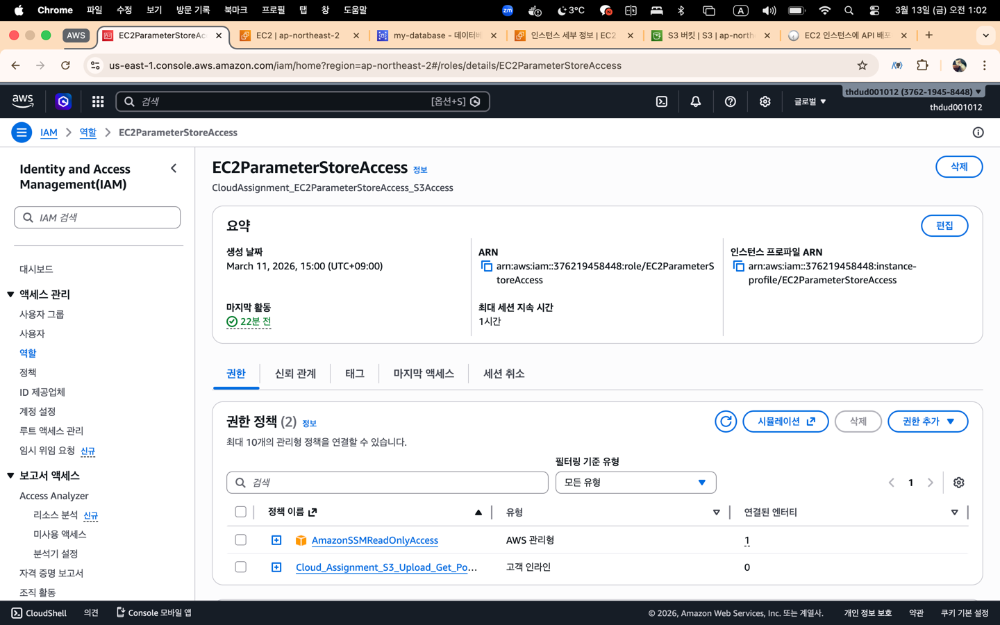
역할에 부여된 Policy
- AmazonSSMReadOnlyAccess
- Cloud_Assignment_S3_Upload_Get_Policy
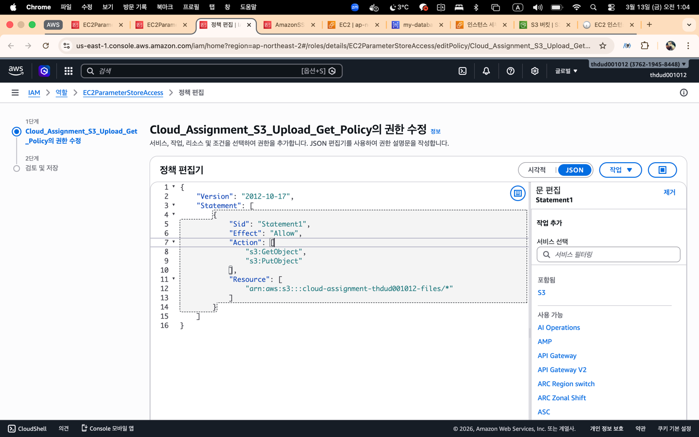

### EC2에 IAM Role 연결 확인
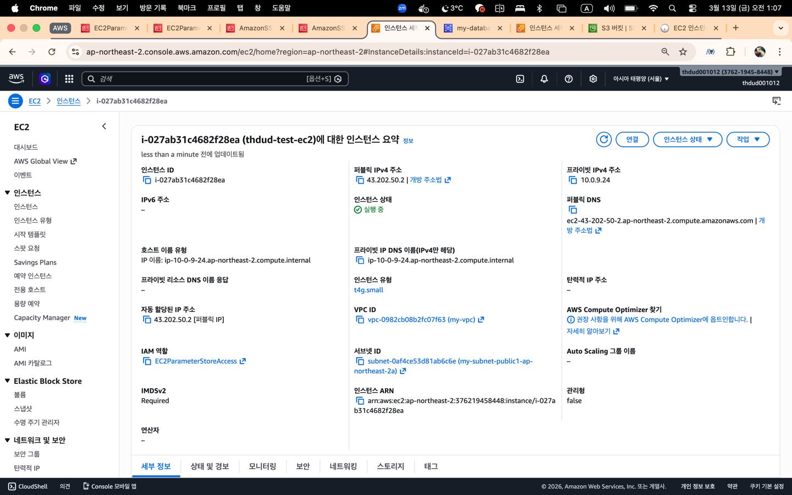

### API 요구사항 확인
```POST /api/members/{id}/profile-image```
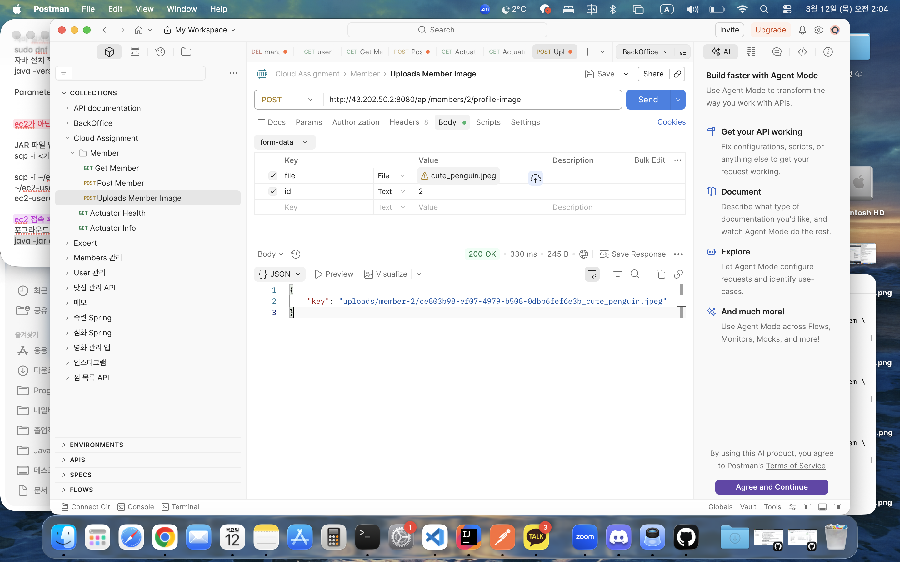

```GET /api/members/{id}/profile-image```

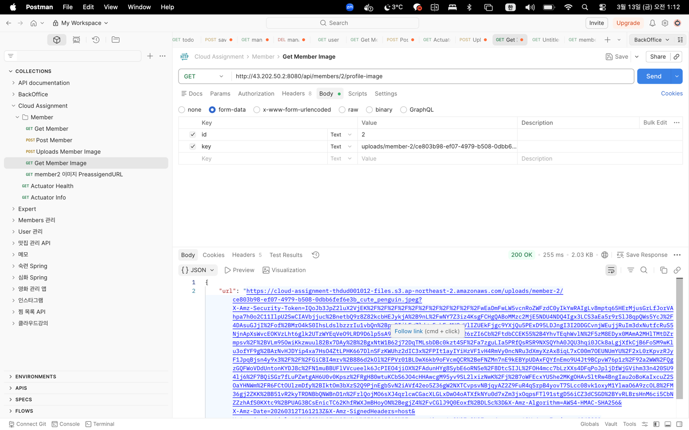

Presigned URL 클릭 시 요쳥 결과

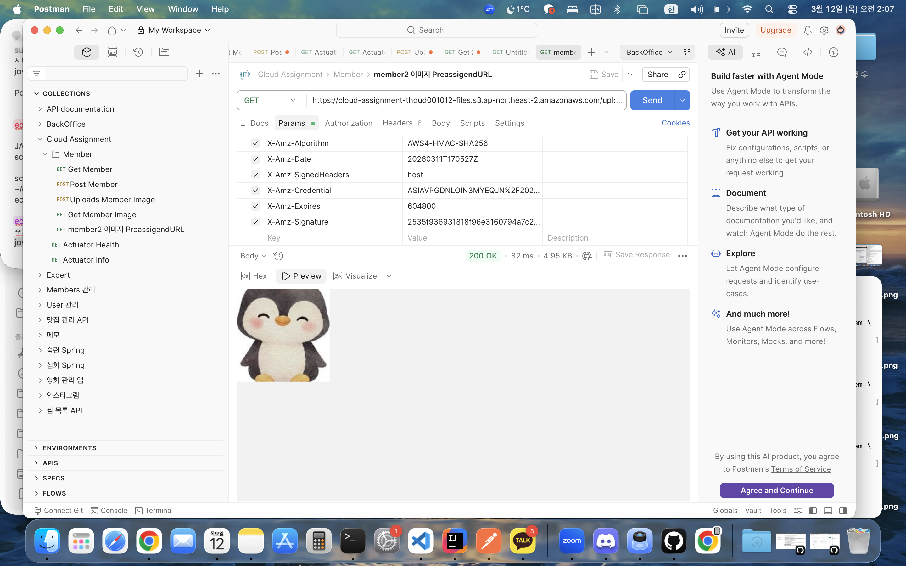

