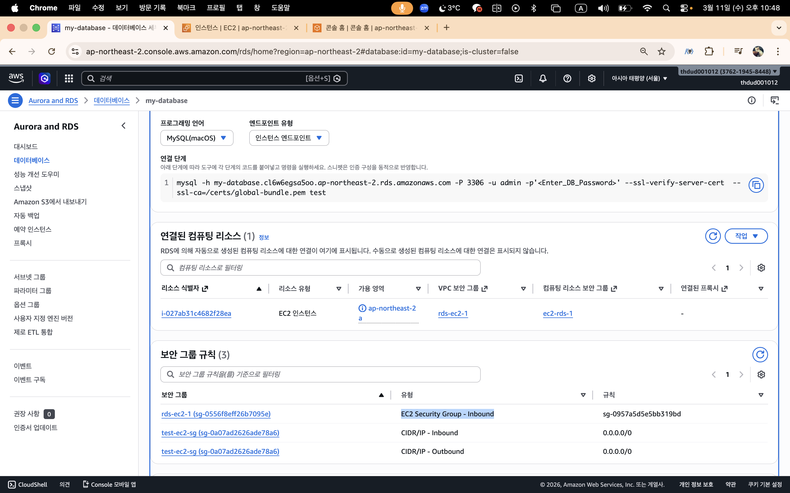

# CH 4 클라우드_아키텍쳐 설계 & 배포

## LV 0 - 요금 폭탄 방지 AWS Budget 설정

## Lv 1 - 네트워크 구축 및 핵심 기능 배포
EC2 Public IP : 43.202.50.2

## Lv 2 - DB 분리 및 보안 연결하기

URL : http://43.202.50.2:8080/actuator/info

파라미터 스토어 설정

## Lv 3 - 프로필 사진 기능 추가와 권한 관리
